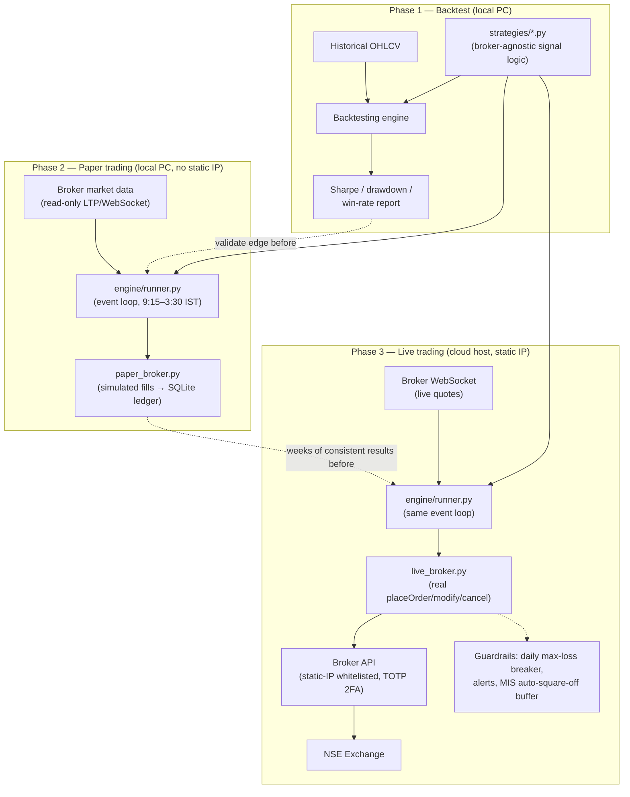
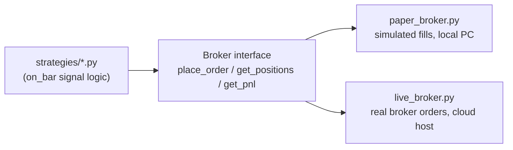

# Automated NSE Intraday Trading System — Overview

## Context

Building automated systematic trading for the Indian stock market (NSE): strategy design/backtesting → paper trading → live automatic order execution via a real broker — free tools only, runnable locally where possible.

**The intraday phase is complete and was rejected** (see `phase-1-backtesting.md`). The project now targets **delivery/CNC cross-sectional momentum** with a monthly rebalance, which removes most of the real-time engineering below: no WebSocket feed, no 9:15–3:30 event loop, no MIS square-off race. A monthly strategy is a cron job that writes an order list.

Key facts that shape this whole plan:

- **TradingView has no official API** — no programmatic backtesting, no programmatic paper trading, no order execution. Its Paper Trading feature is UI-only. Any "TradingView MCP server" is unofficial scraping (ToS/ban risk) and can only *read* charts — never wired into execution.
- **Real backtesting and paper trading happen in Python**, against real historical/live NSE data.
- **Automatic live execution is achievable** via a broker API (e.g. Angel One SmartAPI, free, official Python SDK) — this is the actual automation mechanism, independent of TradingView.
- **SEBI's retail algo-trading framework is fully in force (since April 1, 2026)**: static-IP whitelisting + OAuth + mandatory 2FA apply to **live order-placement API access** only. A single retail bot stays far under the ~10 orders/second threshold that would trigger formal algo registration.
- **Paper trading needs none of that** — read-only market data, no static IP, no cost, runs locally today.

## File map

| File | Covers | Status |
|---|---|---|
| `phase-0-setup.md` | Accounts, API keys, local Python environment | **Complete** — SmartAPI auth + TOTP working, data pipeline built |
| `phase-1-backtesting.md` | Intraday strategy design + backtesting | **COMPLETE — rejected.** 12 strategies, 50 stocks, 2 yrs. A real edge was found (+11.26 bps gross, t=4.00) and shown to be smaller than the ~14 bps cost of trading it. Kill criterion fired. |
| `phase-1b-delivery-momentum.md` | **Delivery/CNC momentum — current focus** | **First real result in.** 205 symbols x 15 yrs. +12.18%/yr over buy-and-hold after costs, 20/20 controls passed, 15/15 sanity checks. Criterion 6 (recent-5y) FAILED at +2.04%/yr. Verdict: not established — walk-forward and the 24-month holdout still outstanding. |
| `phase-2-paper-trading.md` | Local simulated live trading, no real orders | Waiting on Phase 1 |
| `phase-3-live-trading.md` | Real broker orders, static IP, guardrails | Waiting on Phase 2 |
| `phase-4-hardening.md` | Always-on service, reconnect logic, scaling | Waiting on Phase 3 |

## Architecture



Same `strategies/*.py` code runs unchanged in all three phases — only what it's plugged into changes, behind one shared interface:



## Proposed folder structure

```
strategies/          # strategy logic only, broker-agnostic (e.g. orb_strategy.py — Opening Range Breakout)
backtest/            # backtest runner — test against historical data
broker/
  angel_client.py    # broker session/auth, historical data, live quotes/WebSocket
  paper_broker.py    # simulated place_order/positions/PnL — no real orders
  live_broker.py     # real place_order/modify/cancel — used only in Phase 3
engine/
  runner.py          # market-hours event loop: pull data -> strategy.on_bar() -> broker.place_order()
data/                # cached historical OHLCV
infra/
  .env.example       # API key/client-code/TOTP-secret placeholders (never commit real secrets)
main.py              # entrypoint: `python main.py --mode backtest|paper|live`
```

## Master decisions table (updated as each phase file gets finalized)

| Decision | Status | Choice |
|---|---|---|
| Broker | Locked | Angel One SmartAPI |
| Bridge | Locked | Custom-built (not OpenAlgo) |
| Live hosting | Locked | AWS EC2 free tier + Elastic IP, `ap-south-1` |
| Strategy research/charting | Locked | Python (TradingView stays out entirely) |
| Historical data source | Locked | Angel One SmartAPI historical candle API (jugaad-data ruled out — EOD only, can't backtest intraday) |
| Backtesting engine | Locked | Backtesting.py (vectorbt has open bugs on intraday SL/TP+EOD-exit; backtrader unmaintained) |
| Stock universe | Locked | Large-cap NSE cash equity — **Nifty 200** for the delivery work (breadth is needed for cross-sectional ranking) |
| Product | **Locked — changed** | **Delivery (CNC), not intraday (MIS).** Intraday was tested across 12 strategies and rejected: costs (~14 bps) exceed the available edge (~11 bps). Delivery costs 2.1x more per trade but is amortised over multi-week moves. |
| Strategy | Locked | **12-1 cross-sectional momentum + 200-DMA trend filter**, top 20 equal-weight, monthly rebalance. Exit is the rebalance — no SL/TP. |
| Backtest engine (delivery) | Locked | Custom `backtest/portfolio.py` — Backtesting.py is single-instrument and cannot express cross-sectional ranking |

## Notes / open risk items to keep in view

- Angel One's published API rate limits have reportedly shifted over time and aren't perfectly reliable in practice — build retry/backoff regardless.
- WebSocket disconnects are a known Angel One SmartAPI complaint — treat a dropped feed as "stop opening new positions," not "assume nothing changed."
- Broker-side MIS (intraday) auto square-off happens before 3:30 PM and varies by broker — the bot must proactively flatten positions before that, not rely on the broker's own risk system as the exit plan.
